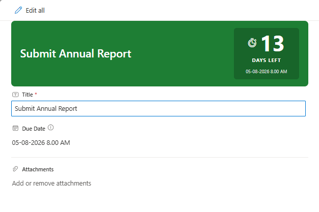

# Countdown Timer Header

## Summary

This SharePoint JSON form header formatter transforms the form header into a color-coded urgency banner. It shows the item title on the left and a countdown badge on the right — displaying days remaining until a due date, a status label (DAYS LEFT / DUE TODAY / OVERDUE), and the formatted due date.

The banner background shifts through four urgency tiers based on days remaining:
- **Green** (`#1e7e34`) — more than 7 days remaining
- **Amber** (`#b8860b`) — 4 to 7 days remaining
- **Red** (`#c0392b`) — 1 to 3 days remaining
- **Crimson** (`#6d0000`) — overdue (0 or fewer days)

It's designed for task lists, project trackers, action item registers, or any list where due-date urgency should be immediately visible when opening a form.



## Form requirements

This formatter is applied to the **Header Format** slot in SharePoint's **Configure Layout** panel.

### Required SharePoint List Columns

| Type                | Internal Name | Required | Description                                 |
| ------------------- | ------------- | :------: | ------------------------------------------- |
| Single line of text | Title         | Yes      | Item name — displayed on the left of the header |
| Date and Time       | DueDate       | Yes      | Target deadline — drives all countdown logic |

### Expression used

Days remaining is computed as:

```
=floor(([$DueDate] - @now) / 86400000)
```

This yields a positive integer (days left), 0 (due today), or a negative integer (overdue). All conditional styling, icon selection, and label text branch from this single expression.

### Provisioning script

A PowerShell script is provided in the [assets](./assets/Create%20List.ps1) folder. It creates the list with the required columns and seeds one item per urgency tier so you can see all four color states immediately.

> **Note:** The script uses [PnP PowerShell](https://pnp.github.io/powershell/). Make sure PnP PowerShell is installed and you can connect to your tenant before running it.

## Sample

Solution|Author
--------|---------
countdown-timer-header.json | [Sudeep Ghatak](https://github.com/sudeepghatak) ([LinkedIn](https://www.linkedin.com/in/sudeepghatak/))

## Version history

Version|Date|Comments
-------|----|--------
1.0|July 23, 2026|Initial release

## Disclaimer

**THIS CODE IS PROVIDED *AS IS* WITHOUT WARRANTY OF ANY KIND, EITHER EXPRESS OR IMPLIED, INCLUDING ANY IMPLIED WARRANTIES OF FITNESS FOR A PARTICULAR PURPOSE, MERCHANTABILITY, OR NON-INFRINGEMENT.**

---

## Additional notes

- **Background color is inline hex** — not Fluent CSS class names. Class-based conditionals in `background-color` style values are unreliable across SharePoint Online tenants.
- **Overdue day count** shows the absolute number of days past due (e.g., `3` not `-3`), paired with the "OVERDUE" label so the meaning is unambiguous.
- **`[$DueDate.displayValue]`** is used (not `[$DueDate]`) to render the locale-formatted date string in the badge subtitle.
- **No gradients** are used — gradient `background` values silently fail to render in SharePoint form formatters.
- The formatter has no footer counterpart — it is a header-only sample.


