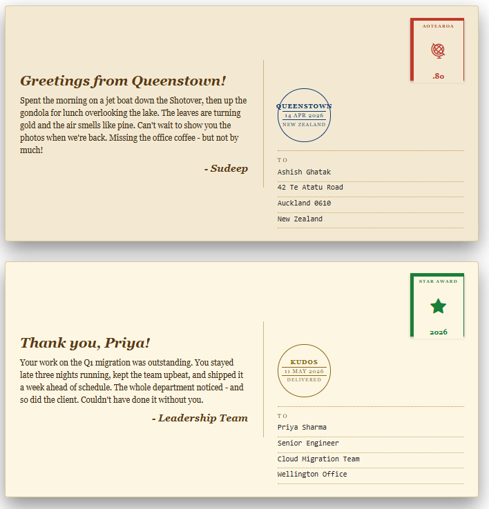

# Postcard with Stamp

## Summary

This SharePoint JSON view formatting sample transforms list items into postcards. Each card renders as a postcard back with a handwritten-style message on the left and a stamp, postmark, and address block on the right. The postmark is rotated and overlaps the stamp to mimic an ink cancellation.

It's designed for travel logs, kudos/recognition messages, announcements, or any "note from somewhere" style list.

## View requirements

### Recommended SharePoint List Columns

| Column Name      | Internal Name   | Type                  | Description                                                                              |
| ---------------- | --------------- | --------------------- | ---------------------------------------------------------------------------------------- |
| Title            | Title           | Single line of text   | Postcard greeting (e.g. `Greetings from Queenstown!`)                                    |
| Message          | Message         | Multiple lines of text| Body of the postcard, rendered in handwriting-style font                                 |
| Signoff          | Signoff         | Single line of text   | Sign-off line (e.g. `- Sudeep`), rendered in cursive                                     |
| Stamp Country    | StampCountry    | Single line of text   | Country / region label printed at the top of the stamp                                   |
| Stamp Price      | StampPrice      | Single line of text   | Denomination shown at the bottom of the stamp (e.g. `$2.80`, `EUR 1.50`)                 |
| Stamp Icon       | StampIcon       | Single line of text   | Fluent UI icon name shown as the stamp's "art" (e.g. `Globe2`, `Flag`, `Airplane`)       |
| Stamp Color      | StampColor      | Single line of text   | Hex for the stamp frame and inner text (e.g. `#c0392b`)                                  |
| Postmark City    | PostmarkCity    | Single line of text   | Top line of the circular postmark (e.g. `QUEENSTOWN`)                                    |
| Postmark Date    | PostmarkDate    | Single line of text   | Middle line of the postmark, framed with rules (e.g. `14 APR 2026`)                      |
| Postmark Country | PostmarkCountry | Single line of text   | Bottom line of the postmark (e.g. `NEW ZEALAND`)                                         |
| Address Line 1   | AddressLine1    | Single line of text   | Recipient name                                                                           |
| Address Line 2   | AddressLine2    | Single line of text   | Street address                                                                           |
| Address Line 3   | AddressLine3    | Single line of text   | City + postal code                                                                       |
| Address Line 4   | AddressLine4    | Single line of text   | Country                                                                                  |
| Background Color | BackgroundColor | Single line of text   | Hex for the postcard paper (e.g. `#f3e9d2` cream)                                        |
| Accent Color     | AccentColor     | Single line of text   | Hex for the postmark border and text (e.g. `#0e3a73` ink blue)                           |

A PowerShell script has been provided in the [assets](./assets/Create%20List.ps1) folder to provision the list for you. The script also seeds 4 sample postcards (travel, kudos, dispatch, vintage airmail) covering the visual variety in the design.

**Note:** This script uses [PnP PowerShell](https://pnp.github.io/powershell/) and requires an environment ready for PnP PowerShell.

## Sample

Solution|Author
--------|---------
postcard-with-stamp.json | [Sudeep Ghatak](https://github.com/sudeepghatak) ([LinkedIn](https://www.linkedin.com/in/sudeepghatak/))

## Version history

Version|Date|Comments
-------|----|--------
1.0|May 13, 2026|Initial release

## Disclaimer

**THIS CODE IS PROVIDED *AS IS* WITHOUT WARRANTY OF ANY KIND, EITHER EXPRESS OR IMPLIED, INCLUDING ANY IMPLIED WARRANTIES OF FITNESS FOR A PARTICULAR PURPOSE, MERCHANTABILITY, OR NON-INFRINGEMENT.**

---

## Additional notes

- **Two-column layout.** The card uses a flex row: left side is the handwritten message, right side stacks the stamp (top), postmark (overlapping, rotated -12deg) and address block (bottom).
- **Colours and icons are column-driven.** `BackgroundColor`, `StampColor`, `AccentColor` and `StampIcon` are all read from list columns - no nested conditionals, no expressions in style values beyond simple column substitution. You can re-skin per card without editing the JSON.
- **Postmark sits inline below the stamp** as an upright circular badge with the city, date (framed with rules) and country. Earlier drafts of this template used `transform: rotate(-12deg)` and `position: absolute` to make the postmark overlap the stamp like an ink cancellation, but those CSS properties are not reliably honoured by the SharePoint view formatter and caused the row to render blank, so the layout is now stacked.
- **Border properties are split** (`border-style`, `border-width`, `border-color`) rather than using the `border` shorthand. The SharePoint formatter does not reliably substitute column references inside composite CSS values, so split properties are used wherever a column-driven colour is needed.
- **Fonts**. The card uses `Georgia, serif` italic for the greeting and sign-off (close approximation of a handwritten note without relying on cursive font families that browsers may not have) and `Consolas, monospace` for the address block to give the "typewriter form" look. Earlier drafts used `Brush Script MT` / `Lucida Handwriting` / `Bradley Hand` but those single-quoted multi-word font names broke rendering in some tenants.
- **Address lines render with dotted underlines** even when empty - this gives the postcard a writable "form" feel. Leave any of the 4 lines blank to show a printed empty line.
- The stamp is a colour-framed cream rectangle with the country, a Fluent UI icon, and the denomination stacked vertically. No image asset is required.

